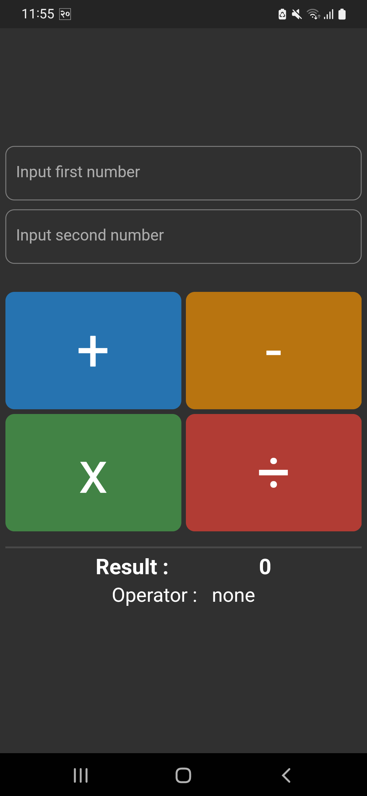
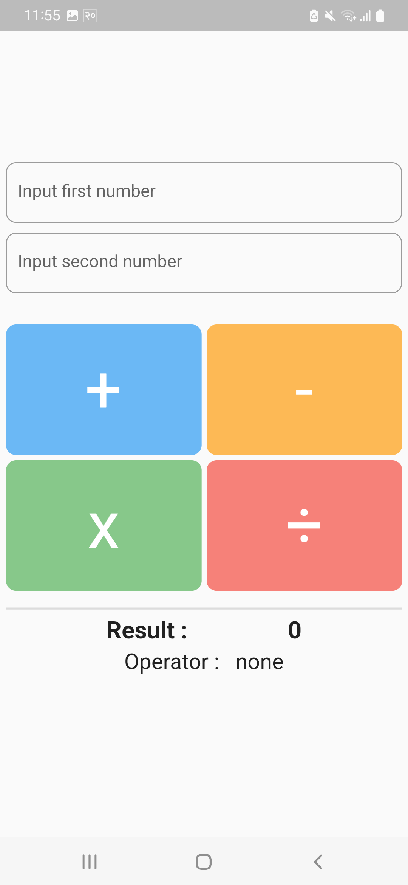
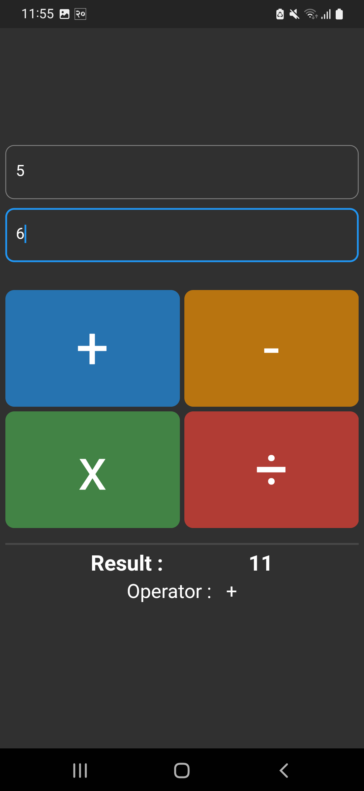
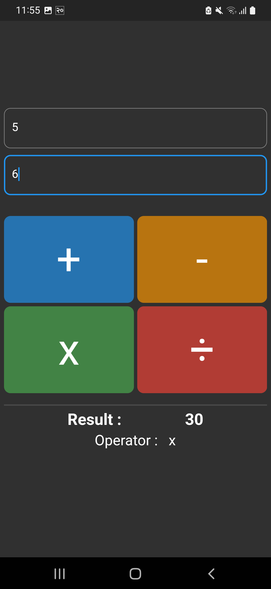

# Calculator

Simple Calculator app using flutter.

Takes two numbers as an input and produces corresponding output with respect to operator.

#### There are four operators 
> Addition: +
>
> Substraction: -
> 
> Multiplication: x
> 
> Division: /

### pubspec.yaml specs
> environment:
>
>  sdk: ">=2.17.6 <3.0.0"

Dependencies used in project
> fluttertoast: ^8.0.9

<!--  -->

